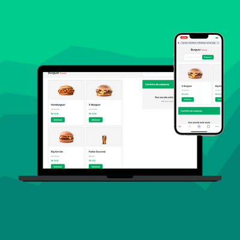

# 🍟 Food Ecommerce

This is the very first react frontend that I developed!  It is an food ecommerce!

> Check the deployed [app](https://burger-ecommerce.vercel.app/).

💭 features:\
\
:heavy_check_mark: Fetch products from an API.
:heavy_check_mark: Automatically updated products while typing for a search
Developed mobile first.

## 📋 Instalation guide

- Clone this repo;
- On the root folder execute `yarn install`;
- On the root folder execute `yarn start`;
- Check the applicaton running on `http://localhost:3000/`

## 💻 Tech stack

  
  
